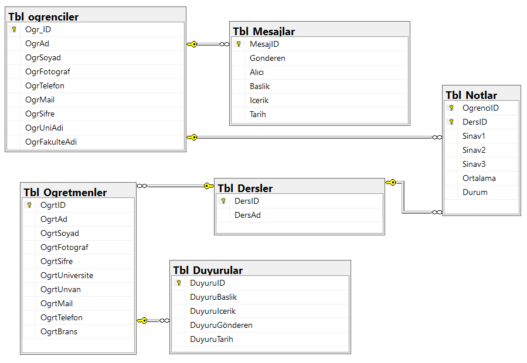

# 🎓 University Information System

[](https://dotnet.microsoft.com/en-us/download/dotnet-framework/net48)
[](https://dotnet.microsoft.com/en-us/apps/aspnet/mvc)
[](https://learn.microsoft.com/en-us/ef/ef6/)

A comprehensive management system designed for universities to bridge the communication gap between academics and students. This project was developed as a 2nd-year internship project to master the **ASP.NET MVC** architecture and **Database-First** approach.

---

## Key Features

### 👨‍🏫 Academic Panel
* **Student Management:** View and manage comprehensive student lists.
* **Grade Entry:** Dynamic grade entry for midterm and final exams with automatic GPA calculation.
* **Announcement Portal:** Create and publish department-wide announcements.
* **Internal Messaging:** Direct communication channel between staff and students.

### 👨‍🎓 Student Panel
* **Personal Dashboard:** Real-time access to personal academic announcements.
* **Grade Tracking:** Instant access to exam results and semester performance.
* **Profile Management:** Secure password updates and personal information tracking.

---

## Tech Stack

-   **Backend:** C# / ASP.NET MVC 5
-   **Database:** MSSQL with Entity Framework 6 (Database-First)
-   **Frontend:** Razor Views, Bootstrap 4, FontAwesome icons
-   **Authentication:** Role-based Session management

---
<details>
  <summary><b>📊 Click to view Database Schema</b></summary>
  
  <p align="center">
    
  </p>
</details>

## Setup

1.  **Clone the Repository:**
    ```bash
    git clone https://github.com/melisaonl/university-information-system.git
    ```
2.  **Database Configuration:**
    -   Open `Web.config`.
    -   Locate the `connectionString` and update the `data source` to your local SQL Server instance.
3.  **Restore Packages:**
    -   Open the `.sln` file in Visual Studio.
    -   Right-click on the Solution and select **Restore NuGet Packages**.
4.  **Run:**
    -   Press `F5` to build and launch the application.
---


